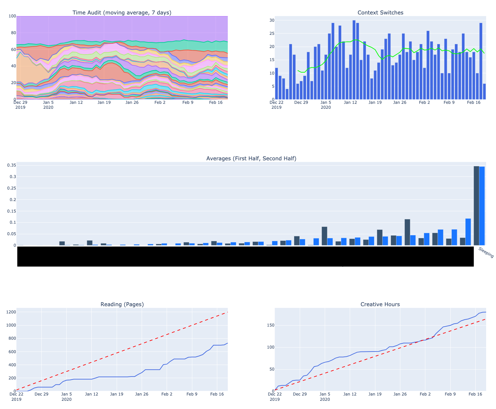

# `time_audit`

A visualization for time management. Metrics tracked:

* 7-day rolling average of percentage time spent on a given activity
* Activity context switches
* Comparison of averages in first half vs second half of the eval window
* Cumulative "Creative Hours" goal
* Cumulative reading goals (number of pages)

